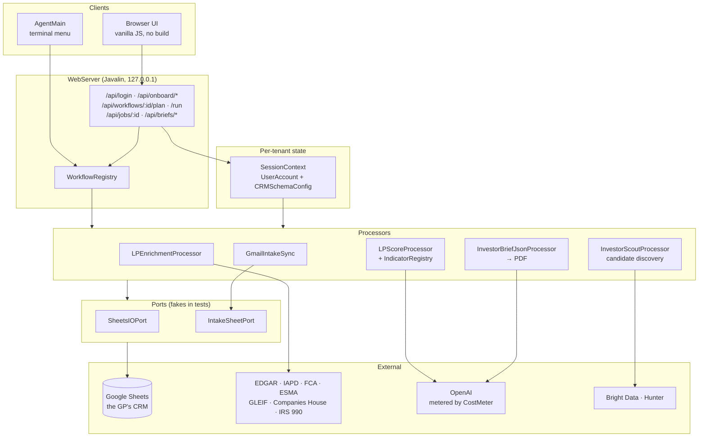
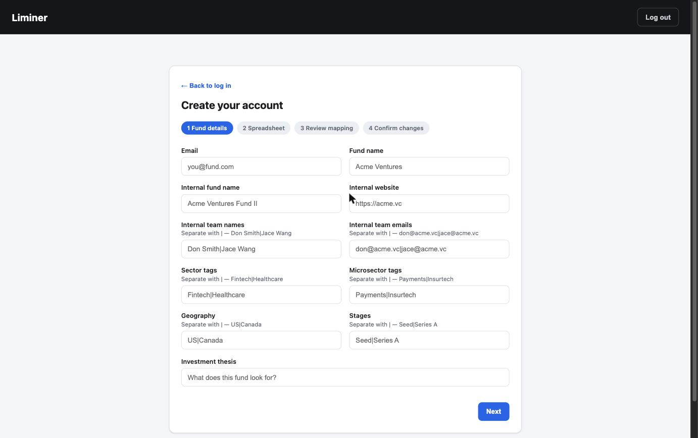

# Liminer

[](https://github.com/rohanpunnoosep-afk/liminer-crm/actions/workflows/ci.yml)

**Liminer is an Agentic Partner for VC Fundraising.**


Liminer's deliverables for General Partners (GPs) of VC funds:

- **Connects to the GP's workflow**
  - Detects the GP's spreadsheet CRM schema
  - Writes to the correct columns without disturbing GP data
- **Records email communication between GPs and potential investors in the CRM**
  - Records date of last contact, pulls representative and fund contact details,
    builds a brief email description, labels the maturity of the conversation
  - Adds all of it under the CRM's own schema
- **Enriches CRM data on prospective investors**
  - Collects data from numerous indicators
    - Government public regulatory sources — EDGAR, IRS 990, IAPD, and others
    - Websites, LinkedIn, and news sources
  - Records data under three main topics:
    1. **Thesis Fit** — past investments, thesis stated in government forms,
       website declarations
    2. **Resource Fit** — past amounts invested, assets under management
    3. **Timing Fit** — time since last investment, new management of the fund
- **Analyzes prospective investors and reports to the GP**
  - Summarizes the relationship history from the communication record to flag
    unfilled promises and topics to cover
  - Produces scores for Fit, Resource, and Timing
  - Builds a full PDF brief on a particular investor with enriched data,
    analysis, and next-step recommendations
- **Relationship partner**
  - Prioritizes investors to follow up with based on Strategic Value and
    communication history
  - Recommends follow-ups and topics to bring up

~49k lines of Java, no ORM, no framework beyond an embedded HTTP server, and a
frontend with no build step.

---

## Notable Constraints


**The client's database is their own spreadsheet.** There is no schema you control,
no migration, and no transaction. Column order differs per fund, tab names drift
(`"LP CRM"` becomes `" LP CRM "`), and the GP edits the sheet by hand while your
job is running. Every read builds a header map first and resolves columns by
name; nothing addresses a column by index. Each client's detected schema is
stored in a registry (`CRMRegistry`, backed by a user database sheet) and loaded
back into a `SessionContext` when that client logs in, so every processor works
against that tenant's own column mapping rather than a global one.

**LLM calls cost real money per run.** `CostMeter` prices every OpenAI call by
model and token count, aggregates across a parallel run, and
`CostCeilingExceededException` aborts the run at a hard ceiling
(`LIMINER_MAX_RUN_USD`) rather than discovering the bill later. The meter binds
to a thread and propagates into pool threads via `CostMeter.wrap`. Beyond
metering, the work itself is batched: rows are processed through bounded thread
pools with several queues (row work, snapshot writes, scout prefetch) so calls
overlap instead of running one at a time, and responses are cached. `ScrapeCache`
deduplicates fetches and model calls within a run, and `ScoutFitProfileCache`
persists profile extractions across runs and across clients — a candidate
extracted once for client A costs $0 for client B. Together this is a large speed
and cost win on every workflow that touches the same funds twice.

**Data is sparse and scattered.** No single source describes an LP well. Liminer
runs many independent indicators — regulatory AUM, Form ADV strategy, IRS 990
assets, fund close timing, deal velocity, headcount proxy, thesis fit — and takes
the aggregate reading rather than trusting any one of them. A missing filing, a
stale website, or one bad scrape moves the score a little instead of producing a
confidently wrong answer.

**Protecting against messing up a client's data.** This is real financial data: a
fund's live fundraising pipeline. Corrupting it is not a cosmetic bug, it is
damage to the GP's raise. So Liminer never writes a rectangle to a client tab —
the Sheets API happily accepts `A2:Z400` and overwrites every cell in it,
including the GP's own notes in column M. Instead it finds the affected row span,
then reads and writes **one column at a time**. That constraint shapes
`SheetsIOPort`, `CrmUpdater`, and every processor that touches a CRM. Internal
hidden tabs that Liminer owns outright (`SnapshotStore`, `ScoutLedger`) are
allowed full-rectangle reads, and the code says so at each exception. On top of
that, every workflow with side effects has a `/plan` endpoint that runs the same
eligibility logic as `/run` and returns exactly what would change — eligible row
count, per-column diffs — while writing nothing, so the GP previews the change
before it happens. `WorkflowPreviewTest` asserts that calling `/plan` twice is
byte-identical and that the fake sheet port never sees a write.

**Storing data in spreadsheets.** Liminer does not use advanced database
techniques. Structured results are serialized as JSON into a single spreadsheet
cell, and when that information is needed again a reader parses the JSON elements
back into a value object (`InvestorProfile.fromIntelligenceJson`,
`RelationshipSummary.toJSON`). Cell values are capped below the Google Sheets
50,000-character limit so a long evidence blob can never fail a whole write.

---

## Architecture



### Multi-tenant seams

Every boundary that touches the network or a spreadsheet is an interface with a
live implementation and an in-memory fake:

| Seam | Live | Used by tests |
|---|---|---|
| `SheetsIOPort` | `SheetsApp` (Google Sheets API) | `FakeSheet`, which throws on any write |
| `IntakeSheetPort` | `SheetsIntakeSheetPort` | in-memory column store |
| `WebServer.LoginPort` | `CRMRegistry` (user DB sheet) | canned `SessionContext` |
| `WebServer.OnboardPort` | `OnboardService` | throws if touched |
| `WebServer.BriefPort` | `InvestorBriefClient` | fixed brief map |

That is what makes the 37-test suite run in under a second with no credentials,
no network, and no Google account.

Per-tenant state lives in `SessionContext` (`UserAccount` + `CRMSchemaConfig`),
which is created at login and threaded through every processor. No processor
reads global configuration for tenant data.

---

## What it does



**Onboarding wizard** — four steps against an arbitrary GP spreadsheet:
details → AI schema detection → review the proposed column mapping → preview the
columns that will be created → commit. Tab names are normalised against the
sheet's actual tabs (`OnboardTabResolutionTest` covers case and whitespace
drift), and provisioning errs toward creating a new `"… (Liminer)"` column rather
than writing into a column the GP already owns.

**Enrichment and scoring** — indicators in `com.liminer.indicators` each score
one dimension from public data: `RaumIndicator` and `ReportedAumIndicator`
(regulatory AUM), `ADVStrategyIndicator` (Form ADV strategy fit),
`NonprofitAssetsIndicator` (IRS 990), `FundCloseIndicator`, `DealVelocityIndicator`,
`HeadcountProxyIndicator`, `NewAllocatorIndicator`, `ThesisFitIndicator`,
`CrmRelationshipIndicator`. `MacroContextModifier` adjusts for market conditions.
Sources are public registers first — EDGAR, IAPD, the FCA and ESMA registers,
GLEIF, Companies House, IRS 990 — before anything paid.

**Investor Scout** — discovers LP candidates that are not in the CRM yet,
deduplicates against a per-client hidden ledger so a rerun never re-appends,
scores them, and writes new rows as Cold.

**Relationship prioritisation** — Tier-1 signals compute Strategic Value and
Action Urgency on orthogonal axes, so a soft timing read can never zero out an
otherwise strong fund.

**Investor briefs** — a structured JSON brief per contact, rendered to PDF and
downloadable from the Documents section of the web UI.

**Email intake** — `GmailIntakeSync` pulls a labelled Gmail thread set, filters
for relevance, and stages rows for review before they reach the CRM.

---

## Running it

Requires JDK 17+ and Maven.

```bash
mvn compile
mvn dependency:build-classpath -Dmdep.outputFile=cp.txt

# terminal menu
java -cp target/classes:$(cat cp.txt) com.liminer.cli.AgentMain

# web UI on http://127.0.0.1:7070
java -cp target/classes:$(cat cp.txt) com.liminer.web.WebServer
```

```bash
mvn test
```

### Google credentials

```bash
cp src/main/resources/credentials.json.example src/main/resources/credentials.json
```

Fill in your Google OAuth client credentials. The first run stores an OAuth token
under `tokens/`. Neither file is tracked.

### Environment

Copy `.env.example` and fill in what you need. Nothing is required to build or to
run the test suite.

| Variable | Purpose |
|---|---|
| `OPENAI_API_KEY` | LLM calls (schema detection, scoring, briefs) |
| `LIMINER_MAX_RUN_USD` | Hard cost ceiling per run; the run aborts above it |
| `LIMINER_CONTACT_EMAIL` | Contact address sent in the `User-Agent` to public registers |
| `BRIGHT_DATA_API_TOKEN` | SERP and LinkedIn retrieval |
| `HUNTER_API_KEY` | Email discovery |
| `EMAIL_VERIFIER_URL`, `EMAIL_VERIFIER_API_KEY` | Email verification |
| `COMPANIES_HOUSE_API_KEY` | UK Companies House |
| `FCA_API_KEY`, `FCA_API_EMAIL` | FCA register |
| `LIMINER_GMAIL_LABEL` | Gmail label to sync intake from |
| `LIMINER_DEFAULT_USER` | Account for the no-argument CLI intake entry point |
| `LIMINER_PORT`, `LIMINER_HOST` | Web server bind (default `127.0.0.1:7070`) |

The public registers require a contact address in the `User-Agent` — SEC
fair-access rejects anonymous agents, and the UK/EU registers rate-limit them.
`LIMINER_CONTACT_EMAIL` supplies it; see `HttpContact`.

---

## Maturity

**v1 targets a single operator on localhost.** `POST /api/login` accepts an email
and issues an in-memory session token; there is no password, no OAuth, and no
per-tenant credential isolation. The server binds `127.0.0.1` only, and sessions
live in a `ConcurrentHashMap` that is lost on restart. API keys come from the
operator's environment rather than per-tenant storage.

That is a deliberate scope line for v1, not an oversight — the multi-tenant
authentication work is tracked in Issues. Do not expose this to a network as it
stands.

---

## Layout

```
src/main/java/com/liminer/
  cli/          AgentMain — terminal workflow menu
  web/          WebServer, WorkflowRegistry, OnboardService, CRMOnboard
  core/         SessionContext, CRMRegistry, CRMSchemaConfig, CRMFieldRegistry
  sheets/       SheetsApp, SheetsIOPort, CrmUpdater, SnapshotStore
  indicators/   Indicator + IndicatorRegistry + the scoring indicators
  enrich/       public-register and vendor clients
  intake/       Gmail sync, relevance filtering
  scout/        candidate discovery, dedupe ledger, fit scoring
  brief/        investor brief JSON + PDF rendering
  pipeline/     the enrichment/scoring/summary processors
  billing/      CostMeter, CostCeilingExceededException
  llm/          OpenAI client and tool-calling plumbing

src/main/resources/public/   2,415 lines of dependency-free JS/CSS/HTML
src/test/java/com/liminer/   JUnit suite + offline test drivers
```
