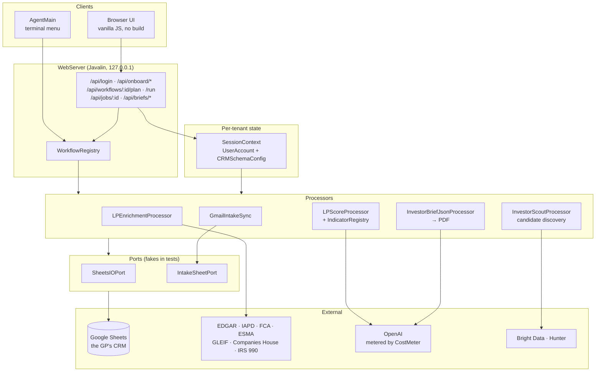

# Liminer

[](https://github.com/rohanpunnoosep-afk/liminer-crm/actions/workflows/ci.yml)

**LP intelligence for VC fundraising, on top of the spreadsheet the fund already
uses as its CRM.**

A General Partner connects their existing Google Sheet. Liminer detects its
schema, enriches prospective limited partners from public regulatory sources,
scores them, and writes the results back into that same sheet — without ever
disturbing a column the GP owns.

~49k lines of Java, no ORM, no framework beyond an embedded HTTP server, and a
frontend with no build step.

---

## Why this is harder than it sounds

The interesting constraints in this system are not the AI parts.

**The database is someone else's spreadsheet.** There is no schema you control,
no migration, and no transaction. Column order differs per fund, tab names drift
(`"LP CRM"` becomes `" LP CRM "`), and the GP edits the sheet by hand while your
job is running. Every read builds a header map first and resolves columns by
name; nothing addresses a column by index.

**A rectangular write is a data-loss bug.** The Sheets API happily accepts
`A2:Z400` and overwrites every cell in it. If the GP keeps their own notes in
column M, a "harmless" batch write silently destroys them. So Liminer never
writes a rectangle to a client tab: it finds the affected row span, then reads
and writes **one column at a time**. That constraint shapes
`SheetsIOPort`, `CrmUpdater`, and every processor that touches a CRM. Internal
hidden tabs that Liminer owns outright (`SnapshotStore`, `ScoutLedger`) are
allowed full-rectangle reads, and the code says so at each exception.

**LLM calls cost real money per run.** `CostMeter` prices every OpenAI call by
model and token count, aggregates across a parallel run, and
`CostCeilingExceededException` aborts the run at a hard ceiling
(`LIMINER_MAX_RUN_USD`) rather than discovering the bill later. The meter binds
to a thread and propagates into pool threads via `CostMeter.wrap`.

**You do not get to guess before writing to someone's CRM.** Every workflow with
side effects has a `/plan` endpoint that runs the same eligibility logic as
`/run` and returns exactly what would change — eligible row count, per-column
diffs — while writing nothing. `WorkflowPreviewTest` asserts that calling `/plan`
twice is byte-identical and that the fake sheet port never sees a write.

---

## Architecture



### Multi-tenant seams

Every boundary that touches the network or a spreadsheet is an interface with a
live implementation and an in-memory fake:

| Seam | Live | Used by tests |
|---|---|---|
| `SheetsIOPort` | `SheetsApp` (Google Sheets API) | `FakeSheet`, which throws on any write |
| `IntakeSheetPort` | `SheetsIntakeSheetPort` | in-memory column store |
| `WebServer.LoginPort` | `CRMRegistry` (user DB sheet) | canned `SessionContext` |
| `WebServer.OnboardPort` | `OnboardService` | throws if touched |
| `WebServer.BriefPort` | `InvestorBriefClient` | fixed brief map |

That is what makes the 37-test suite run in under a second with no credentials,
no network, and no Google account.

Per-tenant state lives in `SessionContext` (`UserAccount` + `CRMSchemaConfig`),
which is created at login and threaded through every processor. No processor
reads global configuration for tenant data.

---

## What it does


**Onboarding wizard** — four steps against an arbitrary GP spreadsheet:
details → AI schema detection → review the proposed column mapping → preview the
columns that will be created → commit. Tab names are normalised against the
sheet's actual tabs (`OnboardTabResolutionTest` covers case and whitespace
drift), and provisioning errs toward creating a new `"… (Liminer)"` column rather
than writing into a column the GP already owns.

**Enrichment and scoring** — indicators in `com.liminer.indicators` each score
one dimension from public data: `RaumIndicator` and `ReportedAumIndicator`
(regulatory AUM), `ADVStrategyIndicator` (Form ADV strategy fit),
`NonprofitAssetsIndicator` (IRS 990), `FundCloseIndicator`, `DealVelocityIndicator`,
`HeadcountProxyIndicator`, `NewAllocatorIndicator`, `ThesisFitIndicator`,
`CrmRelationshipIndicator`. `MacroContextModifier` adjusts for market conditions.
Sources are public registers first — EDGAR, IAPD, the FCA and ESMA registers,
GLEIF, Companies House, IRS 990 — before anything paid.

**Investor Scout** — discovers LP candidates that are not in the CRM yet,
deduplicates against a per-client hidden ledger so a rerun never re-appends,
scores them, and writes new rows as Cold.

**Relationship prioritisation** — Tier-1 signals compute Strategic Value and
Action Urgency on orthogonal axes, so a soft timing read can never zero out an
otherwise strong fund.

**Investor briefs** — a structured JSON brief per contact, rendered to PDF and
downloadable from the Documents section of the web UI.

**Email intake** — `GmailIntakeSync` pulls a labelled Gmail thread set, filters
for relevance, and stages rows for review before they reach the CRM.

---

## Running it

Requires JDK 17+ and Maven.

```bash
mvn compile
mvn dependency:build-classpath -Dmdep.outputFile=cp.txt

# terminal menu
java -cp target/classes:$(cat cp.txt) com.liminer.cli.AgentMain

# web UI on http://127.0.0.1:7070
java -cp target/classes:$(cat cp.txt) com.liminer.web.WebServer
```

```bash
mvn test
```

### Google credentials

```bash
cp src/main/resources/credentials.json.example src/main/resources/credentials.json
```

Fill in your Google OAuth client credentials. The first run stores an OAuth token
under `tokens/`. Neither file is tracked.

### Environment

Copy `.env.example` and fill in what you need. Nothing is required to build or to
run the test suite.

| Variable | Purpose |
|---|---|
| `OPENAI_API_KEY` | LLM calls (schema detection, scoring, briefs) |
| `LIMINER_MAX_RUN_USD` | Hard cost ceiling per run; the run aborts above it |
| `LIMINER_CONTACT_EMAIL` | Contact address sent in the `User-Agent` to public registers |
| `BRIGHT_DATA_API_TOKEN` | SERP and LinkedIn retrieval |
| `HUNTER_API_KEY` | Email discovery |
| `EMAIL_VERIFIER_URL`, `EMAIL_VERIFIER_API_KEY` | Email verification |
| `COMPANIES_HOUSE_API_KEY` | UK Companies House |
| `FCA_API_KEY`, `FCA_API_EMAIL` | FCA register |
| `LIMINER_GMAIL_LABEL` | Gmail label to sync intake from |
| `LIMINER_DEFAULT_USER` | Account for the no-argument CLI intake entry point |
| `LIMINER_PORT`, `LIMINER_HOST` | Web server bind (default `127.0.0.1:7070`) |

The public registers require a contact address in the `User-Agent` — SEC
fair-access rejects anonymous agents, and the UK/EU registers rate-limit them.
`LIMINER_CONTACT_EMAIL` supplies it; see `HttpContact`.

---

## Maturity

**v1 targets a single operator on localhost.** `POST /api/login` accepts an email
and issues an in-memory session token; there is no password, no OAuth, and no
per-tenant credential isolation. The server binds `127.0.0.1` only, and sessions
live in a `ConcurrentHashMap` that is lost on restart. API keys come from the
operator's environment rather than per-tenant storage.

That is a deliberate scope line for v1, not an oversight — the multi-tenant
authentication work is tracked in Issues. Do not expose this to a network as it
stands.

---

## Layout

```
src/main/java/com/liminer/
  cli/          AgentMain — terminal workflow menu
  web/          WebServer, WorkflowRegistry, OnboardService, CRMOnboard
  core/         SessionContext, CRMRegistry, CRMSchemaConfig, CRMFieldRegistry
  sheets/       SheetsApp, SheetsIOPort, CrmUpdater, SnapshotStore
  indicators/   Indicator + IndicatorRegistry + the scoring indicators
  enrich/       public-register and vendor clients
  intake/       Gmail sync, relevance filtering
  scout/        candidate discovery, dedupe ledger, fit scoring
  brief/        investor brief JSON + PDF rendering
  pipeline/     the enrichment/scoring/summary processors
  billing/      CostMeter, CostCeilingExceededException
  llm/          OpenAI client and tool-calling plumbing

src/main/resources/public/   2,415 lines of dependency-free JS/CSS/HTML
src/test/java/com/liminer/   JUnit suite + offline test drivers
```
